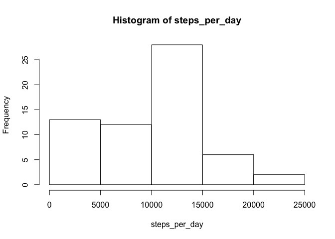
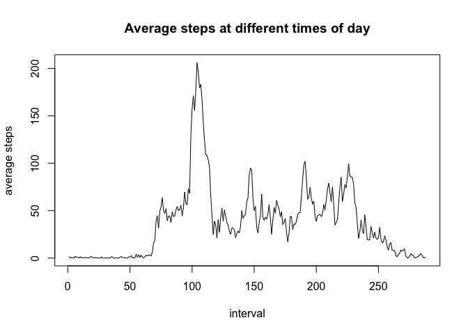
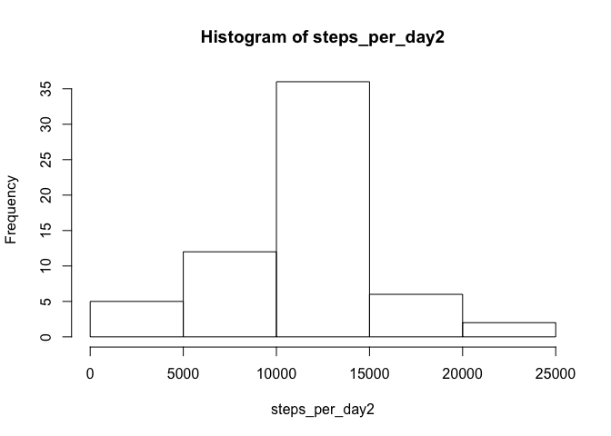
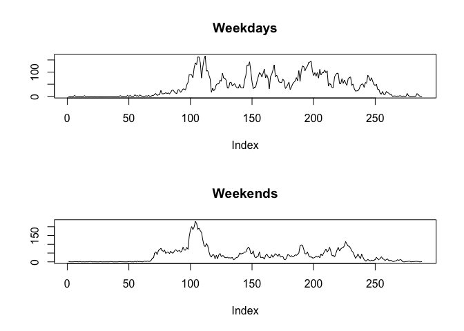

# Reproducible Research: Peer Assessment 1


## Loading and preprocessing the data

```r
activity_url <- 'https://d396qusza40orc.cloudfront.net/repdata%2Fdata%2Factivity.zip'
temp <- tempfile()
download.file(activity_url, temp)
unzip(temp, "activity.csv")
mydata <- read.csv("activity.csv")
unlink(temp)
```

```r
mydata$date <- as.Date(mydata$date)
```

## What is mean total number of steps taken per day?

```r
steps_per_day <- tapply(mydata$steps, mydata$date, sum, na.rm = TRUE)
hist(steps_per_day)
```

<!-- -->

```r
mean_steps <- mean(steps_per_day, na.rm = TRUE)
median_steps <- median(steps_per_day, na.rm = TRUE)
```
The mean number of steps per day (rounded to the nearest integer) was 9354 and the median number was 10395.

## What is the average daily activity pattern?

```r
daily_steps <- tapply(mydata$steps, mydata$interval, mean, na.rm = TRUE)
plot(daily_steps, type = 'l', xlab = 'interval', ylab = 'average steps', main = 'Average steps at different times of day')
```

<!-- -->

```r
max_interval <- which.max(daily_steps)
```
The maximum average number of steps occurred at interval 104.

## Imputing missing values

```r
library(data.table)
library(tidyverse)
mydata <- as.data.table(mydata)
mydata[,steps_mean := mean(steps, na.rm = TRUE), by = interval]
```

```
##        steps       date interval steps_mean
##     1:    NA 2012-10-01        0  1.7169811
##     2:    NA 2012-10-01        5  0.3396226
##     3:    NA 2012-10-01       10  0.1320755
##     4:    NA 2012-10-01       15  0.1509434
##     5:    NA 2012-10-01       20  0.0754717
##    ---                                     
## 17564:    NA 2012-11-30     2335  4.6981132
## 17565:    NA 2012-11-30     2340  3.3018868
## 17566:    NA 2012-11-30     2345  0.6415094
## 17567:    NA 2012-11-30     2350  0.2264151
## 17568:    NA 2012-11-30     2355  1.0754717
```

```r
mydata[is.na(steps),steps_imp := steps_mean]
```

```
##        steps       date interval steps_mean steps_imp
##     1:    NA 2012-10-01        0  1.7169811 1.7169811
##     2:    NA 2012-10-01        5  0.3396226 0.3396226
##     3:    NA 2012-10-01       10  0.1320755 0.1320755
##     4:    NA 2012-10-01       15  0.1509434 0.1509434
##     5:    NA 2012-10-01       20  0.0754717 0.0754717
##    ---                                               
## 17564:    NA 2012-11-30     2335  4.6981132 4.6981132
## 17565:    NA 2012-11-30     2340  3.3018868 3.3018868
## 17566:    NA 2012-11-30     2345  0.6415094 0.6415094
## 17567:    NA 2012-11-30     2350  0.2264151 0.2264151
## 17568:    NA 2012-11-30     2355  1.0754717 1.0754717
```

```r
mydata[!is.na(steps), steps_imp := steps]
```

```
##        steps       date interval steps_mean steps_imp
##     1:    NA 2012-10-01        0  1.7169811 1.7169811
##     2:    NA 2012-10-01        5  0.3396226 0.3396226
##     3:    NA 2012-10-01       10  0.1320755 0.1320755
##     4:    NA 2012-10-01       15  0.1509434 0.1509434
##     5:    NA 2012-10-01       20  0.0754717 0.0754717
##    ---                                               
## 17564:    NA 2012-11-30     2335  4.6981132 4.6981132
## 17565:    NA 2012-11-30     2340  3.3018868 3.3018868
## 17566:    NA 2012-11-30     2345  0.6415094 0.6415094
## 17567:    NA 2012-11-30     2350  0.2264151 0.2264151
## 17568:    NA 2012-11-30     2355  1.0754717 1.0754717
```

```r
mydata2 <- select(mydata, steps_imp, date, interval)
setnames(mydata2, 'steps_imp','steps')

steps_per_day2 <- tapply(mydata2$steps, mydata2$date, sum, na.rm = TRUE)
hist(steps_per_day2)
```

<!-- -->

```r
mean_steps2 <- mean(steps_per_day2, na.rm = TRUE)
median_steps2 <- median(steps_per_day2, na.rm = TRUE)
```
The original dataset has 2304 missing step values.

The missing step values will be imputed using the mean at that time interval across all days with step values for that interval, as it appears from the time series plot that step values vary greatly by time of day.

After imputation, the mean number of steps per day was 10766 and the median number of steps per day was 10766 (both have been rounded to the nearest integer). These values are slightly higher than those from the mydata dataset excluding missing values.

## Are there differences in activity patterns between weekdays and weekends?

```r
weekend <- c('Saturday','Sunday')
mydata2$day <- factor(x = !(weekdays(mydata2$date) %in% weekend), labels = c('weekday','weekend'))
weekday_intervals <- tapply(mydata2$steps[mydata2$day == 'weekday'], mydata2$interval[mydata2$day == 'weekday'], mean)
weekend_intervals <- tapply(mydata2$steps[mydata2$day == 'weekend'], mydata2$interval[mydata2$day == 'weekend'], mean)
par(mfrow = c(2,1))
plot(weekday_intervals, type = 'l', main = 'Weekdays', ylab = '')
plot(weekend_intervals, type = 'l', main = 'Weekends', ylab = '')
```

<!-- -->
